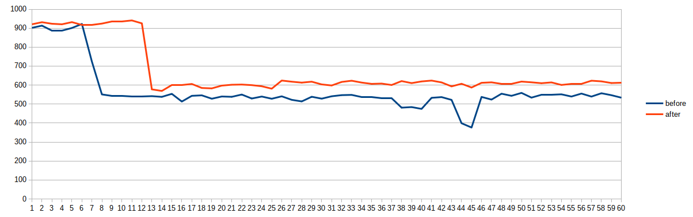

Домашнее задание
### Настройка autovacuum с учетом оптимальной производительности

Цель:
запустить нагрузочный тест pgbench  
настроить параметры autovacuum для достижения максимального уровня устойчивой производительности

<b>Имя проекта - postgres2021-2147483647</b>

создать GCE инстанс типа e2-medium и standard disk 10GB
```console
gcloud compute instances create otus06...
```
установить на него PostgreSQL 13 с дефолтными настройками
```console
[root@otus-06 ~]# yum install -y https://download.postgresql.org/pub/repos/yum/reporpms/EL-7-x86_64/pgdg-redhat-repo-latest.noarch.rpm
[root@otus-06 ~]# yum install -y postgresql14-server
[root@otus-06 ~]# /usr/pgsql-14/bin/postgresql-14-setup initdb
[root@otus-06 ~]# systemctl enable --now postgresql-14
```
применить параметры настройки PostgreSQL из прикрепленного к материалам занятия файла
<pre><code>
max_connections = 40
shared_buffers = 1GB
effective_cache_size = 3GB
maintenance_work_mem = 512MB
checkpoint_completion_target = 0.9
wal_buffers = 16MB
default_statistics_target = 500
random_page_cost = 4
effective_io_concurrency = 2
work_mem = 6553kB
min_wal_size = 4GB
max_wal_size = 16GB
</code></pre>
зайти под пользователем postgres - sudo su postgres
выполнить pgbench -i postgres
```console
-bash-4.2$ /usr/pgsql-14/bin/pgbench -i postgres
dropping old tables...
NOTICE:  table "pgbench_accounts" does not exist, skipping
NOTICE:  table "pgbench_branches" does not exist, skipping
NOTICE:  table "pgbench_history" does not exist, skipping
NOTICE:  table "pgbench_tellers" does not exist, skipping
creating tables...
generating data (client-side)...
100000 of 100000 tuples (100%) done (elapsed 0.09 s, remaining 0.00 s)
vacuuming...
creating primary keys...
done in 0.41 s (drop tables 0.00 s, create tables 0.01 s, client-side generate 0.25 s, vacuum 0.08 s, primary keys 0.07 s).
```
запустить pgbench -c8 -P 10 -T 600 -U postgres postgres
```console
-bash-4.2$ /usr/pgsql-14/bin/pgbench -c8 -P 10 -T 600 -U postgres postgres
pgbench (14.0)
starting vacuum...end.
progress: 10.0 s, 901.6 tps, lat 8.838 ms stddev 4.979
progress: 20.0 s, 913.3 tps, lat 8.751 ms stddev 4.740
progress: 30.0 s, 886.0 tps, lat 9.020 ms stddev 5.079
progress: 40.0 s, 886.4 tps, lat 9.016 ms stddev 5.058
progress: 50.0 s, 900.8 tps, lat 8.875 ms stddev 4.896
progress: 60.0 s, 922.2 tps, lat 8.668 ms stddev 4.721
progress: 70.0 s, 723.6 tps, lat 10.970 ms stddev 15.373
progress: 80.0 s, 550.9 tps, lat 14.519 ms stddev 24.765
progress: 90.0 s, 543.2 tps, lat 14.686 ms stddev 24.307
progress: 100.0 s, 543.5 tps, lat 14.741 ms stddev 24.702
progress: 110.0 s, 540.5 tps, lat 14.763 ms stddev 25.004
progress: 120.0 s, 541.3 tps, lat 14.779 ms stddev 25.059
progress: 130.0 s, 541.7 tps, lat 14.747 ms stddev 24.484
progress: 140.0 s, 538.0 tps, lat 14.848 ms stddev 24.621
progress: 150.0 s, 553.8 tps, lat 14.453 ms stddev 24.207
progress: 160.0 s, 513.2 tps, lat 15.514 ms stddev 25.017
progress: 170.0 s, 543.4 tps, lat 14.737 ms stddev 24.885
progress: 180.0 s, 546.0 tps, lat 14.654 ms stddev 23.822
progress: 190.0 s, 528.2 tps, lat 15.152 ms stddev 25.194
progress: 200.0 s, 539.9 tps, lat 14.791 ms stddev 24.865
progress: 210.0 s, 538.2 tps, lat 14.878 ms stddev 25.542
progress: 220.0 s, 550.2 tps, lat 14.541 ms stddev 24.290
progress: 230.0 s, 529.2 tps, lat 15.110 ms stddev 25.429
progress: 240.0 s, 539.7 tps, lat 14.802 ms stddev 24.597
progress: 250.0 s, 528.0 tps, lat 15.150 ms stddev 25.158
progress: 260.0 s, 540.8 tps, lat 14.780 ms stddev 25.231
progress: 270.0 s, 522.3 tps, lat 15.234 ms stddev 24.994
progress: 280.0 s, 513.9 tps, lat 15.618 ms stddev 25.291
progress: 290.0 s, 538.6 tps, lat 14.849 ms stddev 25.239
progress: 300.0 s, 528.5 tps, lat 15.124 ms stddev 25.664
progress: 310.0 s, 541.0 tps, lat 14.785 ms stddev 25.140
progress: 320.0 s, 547.1 tps, lat 14.630 ms stddev 25.157
progress: 330.0 s, 548.3 tps, lat 14.518 ms stddev 24.587
progress: 340.0 s, 538.0 tps, lat 14.857 ms stddev 24.694
progress: 350.0 s, 537.5 tps, lat 14.876 ms stddev 25.100
progress: 360.0 s, 529.8 tps, lat 14.993 ms stddev 24.688
progress: 370.0 s, 531.7 tps, lat 15.141 ms stddev 24.222
progress: 380.0 s, 481.1 tps, lat 16.592 ms stddev 23.919
progress: 390.0 s, 484.1 tps, lat 16.431 ms stddev 22.492
progress: 400.0 s, 474.6 tps, lat 16.912 ms stddev 26.505
progress: 410.0 s, 533.0 tps, lat 14.993 ms stddev 24.561
progress: 420.0 s, 536.7 tps, lat 14.835 ms stddev 23.500
progress: 430.0 s, 522.0 tps, lat 15.380 ms stddev 24.053
progress: 440.0 s, 398.9 tps, lat 19.878 ms stddev 37.775
progress: 450.0 s, 376.3 tps, lat 21.352 ms stddev 44.921
progress: 460.0 s, 537.6 tps, lat 14.933 ms stddev 25.429
progress: 470.0 s, 523.6 tps, lat 15.331 ms stddev 30.221
progress: 480.0 s, 554.6 tps, lat 14.326 ms stddev 25.000
progress: 490.0 s, 543.4 tps, lat 14.636 ms stddev 24.486
progress: 500.0 s, 558.9 tps, lat 14.342 ms stddev 24.730
progress: 510.0 s, 534.0 tps, lat 14.987 ms stddev 25.414
progress: 520.0 s, 548.8 tps, lat 14.519 ms stddev 24.753
progress: 530.0 s, 549.0 tps, lat 14.624 ms stddev 25.153
progress: 540.0 s, 551.3 tps, lat 14.500 ms stddev 24.034
progress: 550.0 s, 539.7 tps, lat 14.788 ms stddev 24.822
progress: 560.0 s, 555.3 tps, lat 14.372 ms stddev 24.226
progress: 570.0 s, 539.5 tps, lat 14.760 ms stddev 24.912
progress: 580.0 s, 557.0 tps, lat 14.370 ms stddev 23.924
progress: 590.0 s, 546.8 tps, lat 14.607 ms stddev 24.094
progress: 600.0 s, 533.5 tps, lat 14.955 ms stddev 25.032
transaction type: <builtin: TPC-B (sort of)>
scaling factor: 1
query mode: simple
number of clients: 8
number of threads: 1
duration: 600 s
number of transactions actually processed: 342407
latency average = 14.004 ms
latency stddev = 23.398 ms
initial connection time = 24.421 ms
tps = 570.673235 (without initial connection time)
```
дать отработать до конца
дальше настроить autovacuum максимально эффективно
<pre><code>
autovacuum_max_workers = 10
autovacuum_naptime = 5s
autovacuum_vacuum_threshold = 50
autovacuum_analyze_threshold = 5
autovacuum_vacuum_scale_factor = 0.05
autovacuum_analyze_scale_factor = 0.01
autovacuum_vacuum_cost_delay = 10ms
autovacuum_vacuum_cost_limit = 1000
</code></pre>
```console
-bash-4.2$ /usr/pgsql-14/bin/pgbench -c8 -P 10 -T 600 -U postgres postgres
pgbench (14.0)
starting vacuum...end.
progress: 10.0 s, 920.3 tps, lat 8.659 ms stddev 4.042
progress: 20.0 s, 931.3 tps, lat 8.581 ms stddev 4.520
progress: 30.0 s, 923.2 tps, lat 8.659 ms stddev 4.445
progress: 40.0 s, 920.4 tps, lat 8.684 ms stddev 4.674
progress: 50.0 s, 931.8 tps, lat 8.577 ms stddev 4.651
progress: 60.0 s, 917.3 tps, lat 8.714 ms stddev 4.465
progress: 70.0 s, 917.5 tps, lat 8.711 ms stddev 4.684
progress: 80.0 s, 924.0 tps, lat 8.649 ms stddev 4.447
progress: 90.0 s, 934.7 tps, lat 8.551 ms stddev 3.829
progress: 100.0 s, 934.7 tps, lat 8.551 ms stddev 4.453
progress: 110.0 s, 940.6 tps, lat 8.497 ms stddev 4.406
progress: 120.0 s, 925.2 tps, lat 8.640 ms stddev 5.621
progress: 130.0 s, 577.6 tps, lat 13.837 ms stddev 22.237
progress: 140.0 s, 569.1 tps, lat 14.054 ms stddev 21.296
progress: 150.0 s, 600.0 tps, lat 13.324 ms stddev 20.985
progress: 160.0 s, 599.0 tps, lat 13.349 ms stddev 21.831
progress: 170.0 s, 605.9 tps, lat 13.179 ms stddev 20.788
progress: 180.0 s, 584.9 tps, lat 13.666 ms stddev 21.715
progress: 190.0 s, 582.7 tps, lat 13.725 ms stddev 22.422
progress: 200.0 s, 597.3 tps, lat 13.387 ms stddev 21.161
progress: 210.0 s, 601.8 tps, lat 13.271 ms stddev 21.484
progress: 220.0 s, 602.9 tps, lat 13.257 ms stddev 21.204
progress: 230.0 s, 599.8 tps, lat 13.318 ms stddev 21.204
progress: 240.0 s, 593.8 tps, lat 13.451 ms stddev 21.921
progress: 250.0 s, 581.1 tps, lat 13.743 ms stddev 22.553
progress: 260.0 s, 624.0 tps, lat 12.813 ms stddev 22.223
progress: 270.0 s, 617.9 tps, lat 12.937 ms stddev 21.952
progress: 280.0 s, 613.0 tps, lat 13.029 ms stddev 22.192
progress: 290.0 s, 617.9 tps, lat 12.939 ms stddev 21.938
progress: 300.0 s, 603.5 tps, lat 13.234 ms stddev 22.050
progress: 310.0 s, 598.0 tps, lat 13.371 ms stddev 22.573
progress: 320.0 s, 616.7 tps, lat 12.962 ms stddev 21.724
progress: 330.0 s, 623.1 tps, lat 12.804 ms stddev 20.868
progress: 340.0 s, 613.2 tps, lat 13.038 ms stddev 21.268
progress: 350.0 s, 606.4 tps, lat 13.187 ms stddev 22.289
progress: 360.0 s, 608.0 tps, lat 13.148 ms stddev 22.134
progress: 370.0 s, 600.5 tps, lat 13.299 ms stddev 23.804
progress: 380.0 s, 621.1 tps, lat 12.873 ms stddev 22.212
progress: 390.0 s, 610.4 tps, lat 13.098 ms stddev 21.217
progress: 400.0 s, 619.3 tps, lat 12.911 ms stddev 21.220
progress: 410.0 s, 623.7 tps, lat 12.818 ms stddev 20.959
progress: 420.0 s, 614.1 tps, lat 13.019 ms stddev 22.306
progress: 430.0 s, 593.2 tps, lat 13.460 ms stddev 22.725
progress: 440.0 s, 607.0 tps, lat 13.161 ms stddev 22.166
progress: 450.0 s, 587.2 tps, lat 13.613 ms stddev 21.444
progress: 460.0 s, 612.0 tps, lat 13.063 ms stddev 21.366
progress: 470.0 s, 614.5 tps, lat 13.013 ms stddev 21.797
progress: 480.0 s, 606.7 tps, lat 13.176 ms stddev 22.071
progress: 490.0 s, 606.1 tps, lat 13.195 ms stddev 22.803
progress: 500.0 s, 618.5 tps, lat 12.926 ms stddev 21.642
progress: 510.0 s, 614.6 tps, lat 13.008 ms stddev 22.087
progress: 520.0 s, 609.9 tps, lat 13.105 ms stddev 21.982
progress: 530.0 s, 614.1 tps, lat 13.020 ms stddev 21.553
progress: 540.0 s, 600.8 tps, lat 13.296 ms stddev 21.705
progress: 550.0 s, 604.9 tps, lat 13.215 ms stddev 22.289
progress: 560.0 s, 606.8 tps, lat 13.179 ms stddev 21.488
progress: 570.0 s, 623.2 tps, lat 12.828 ms stddev 22.068
progress: 580.0 s, 619.6 tps, lat 12.900 ms stddev 20.949
progress: 590.0 s, 610.9 tps, lat 13.090 ms stddev 22.228
progress: 600.0 s, 612.4 tps, lat 13.058 ms stddev 22.734
transaction type: <builtin: TPC-B (sort of)>
scaling factor: 1
query mode: simple
number of clients: 8
number of threads: 1
duration: 600 s
number of transactions actually processed: 402108
latency average = 11.926 ms
latency stddev = 18.855 ms
initial connection time = 25.079 ms
tps = 670.186611 (without initial connection time)
```
построить график по получившимся значениям  
так чтобы получить максимально ровное значение tps


